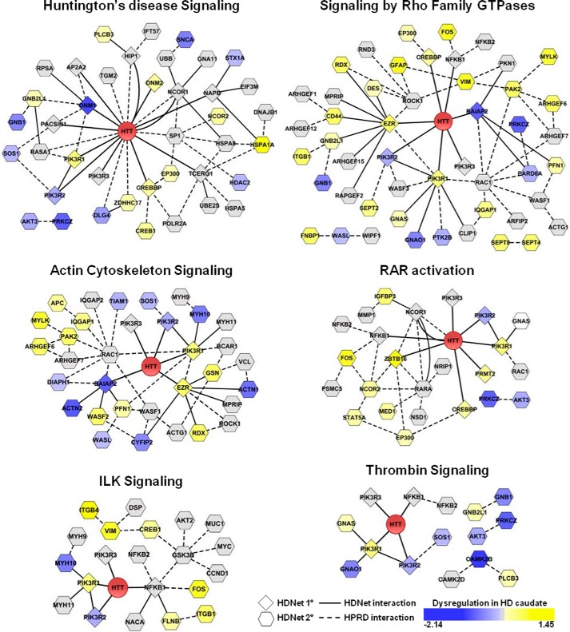
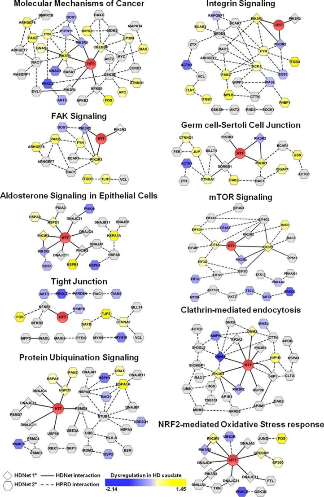
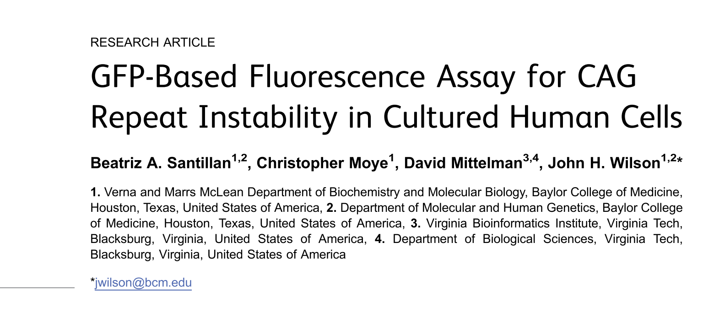
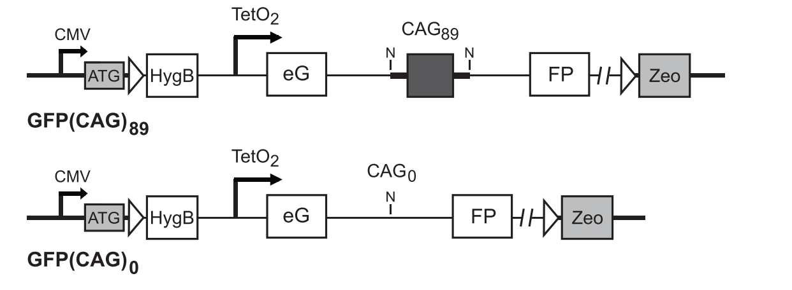
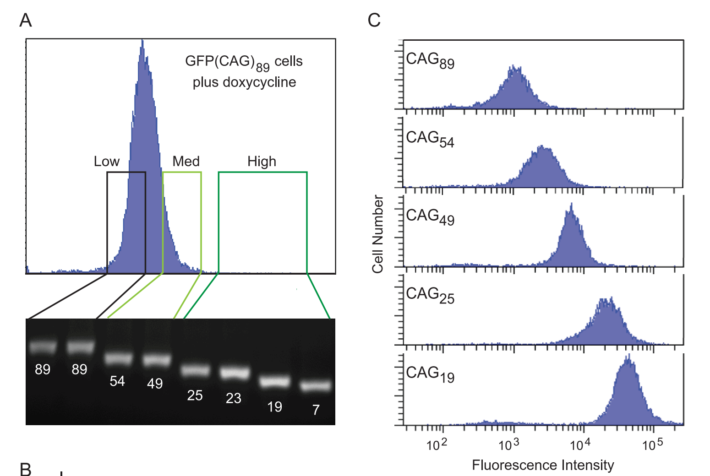
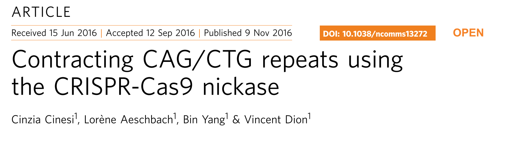
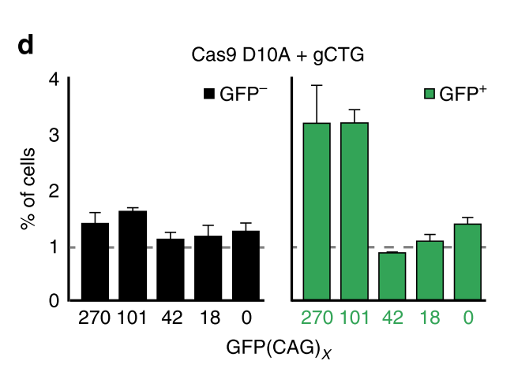
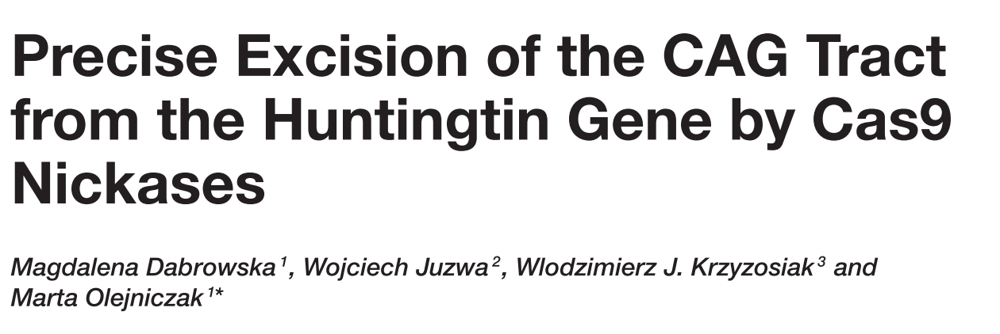
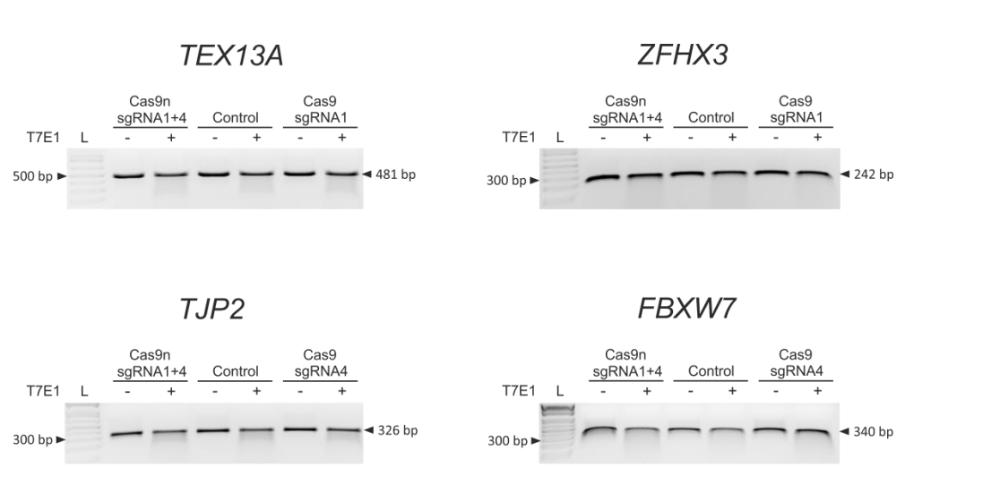
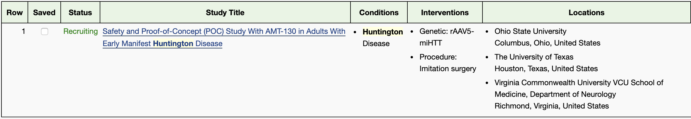

class: middle

background-image: url("/Users/loomba/Desktop/huntington/trinucleotide.jpg")
background-size: contain

---

background-image: url("/Users/loomba/Desktop/huntington/timeline.png")
background-size: contain

---

background-image: url("/Users/loomba/Desktop/huntington/polyq.jpg")
background-size: contain

---
class: center, middle, inverse

# Osmosis.org

--
<iframe width="560" height="315" src="/Users/loomba/Desktop/huntington/httvideo.mp4" frameborder="0"  allowfullscreen></iframe>

---

background-image: url("/Users/loomba/Desktop/huntington/huntingtonincidence.png")
background-size: contain

---
class: center

# HTT protein function unknown

--
.pull-left[]

--
.pull-right[]

.pull-left[The number of possible functionality of the HTT protein and the lack of understanding of the need for a set number of Glutamine repeats forces us to think of strategies that would locally abrogate the *expanded* polyQ regions without affecting the normal protein.]

---

background-image: url("/Users/loomba/Desktop/huntington/httint.png")
background-size: cover

---
class: center

# GFP reporter assay development

.pull-left[]
--
.pull-left[]
--
.right-column[]
--
.left-column[The authors also showed the proof of principle by using ZNF50/51 to induce contractions in the huntington protein.]

---
class: center

# Not the full story

--
- ZNF strategy induced contractions but also expansions. 

--
- Cas9 Double Stranded Breaks (DSB's) induce more contractions but still a high level of expansions observed.

--
- Cas9 D10A nickase strategy induced high level contractions relative to expansions as well as leaving the normal transcripts untouched.

.left-column[]

---
class: center

# Precise editing in patient derived *IPSC's*

--
- The nickase strategy is effective in patient derived cells.

--
- Minimal off-target effects.

.right-column[]

---
class: center

# Somatic Gene Therapy 

### Challenges:

--
- Delivery

--
- Specificity

--
- Toxicity

--
- <iframe width="560" height="315" src="/Users/loomba/Desktop/huntington/AAV.mp4" frameborder="0"  allowfullscreen></iframe>

--
- 

---
class: center, middle, inverse

# THANK YOU FOR YOUR ATTENTION!

